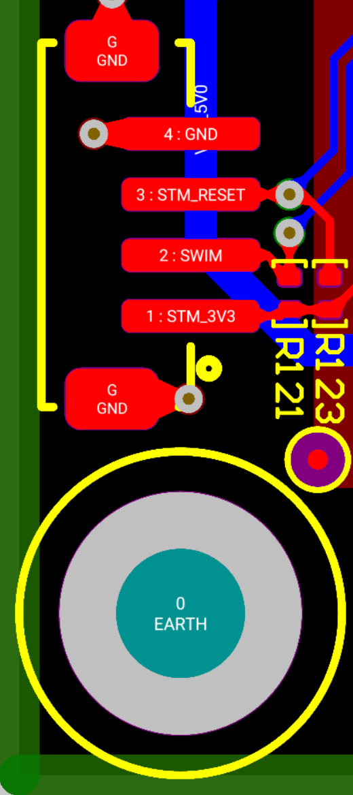
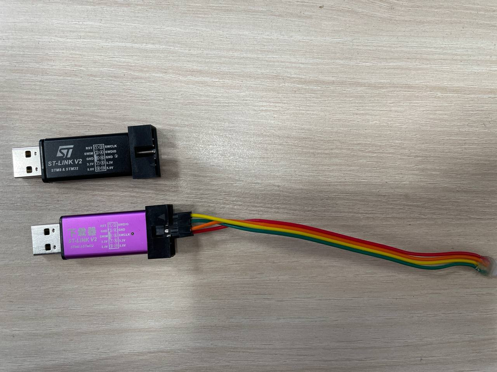
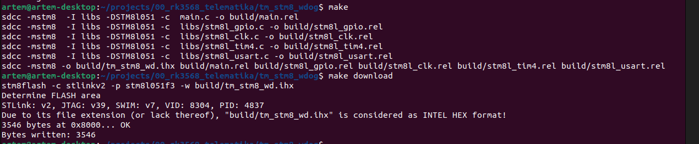

# TM_STM8_WDOG

Watchdog для платы защищенного компьютера. Выполняет функцию обработчика кнопки , управления питанием и Watchdog

В ветке Main проект, который сделан на FSM и обрабатывает нажатие [кнопки](./doc/button.MOV).

При подачи питания - включается.
Длинное нажатие (> 2 сек) во включенном состоянии - прекращение подачи питания.
Короткое нажатие в выключенном состоянии - подача питания на модуль.
Длинное нажатие (> 2 сек) в выключенном состоянии - подача питания на модуль и переход в Bootmode.

В ветке force_start лежит код, который сразу же безусловно подает питание на модуль и больше ничего не делает.

# Программатор
Требуется ST-LINK V2. Разъем для подключения к плате ZHR-4. 

**Pinout на плате:**

| ST-LINK | SM_TM    |
| :---:   | :---: |
| 3.3V   | 1 STM_3V3  |
| SWIM   | 2 SWIM  |
| RST    | 3 STM_RESET  |
| GND    | 4 GND  |

**Программатор**

**Warning!!!**

У разных програматоров отличается pinout. С черным stm8flash в режиме SWIM работает некорректно. C розовым - работает!

# Сборка

Для сборки необходимо установить компилятор sdcc.
<code>
sudo apt install sdcc
make
</code>
# Загрузка прошивки
Для загрузки прошивки нужно установить [stm8flash](https://github.com/vdudouyt/stm8flash)

<code>
make download
</code>

# Пример сборки прошивки

